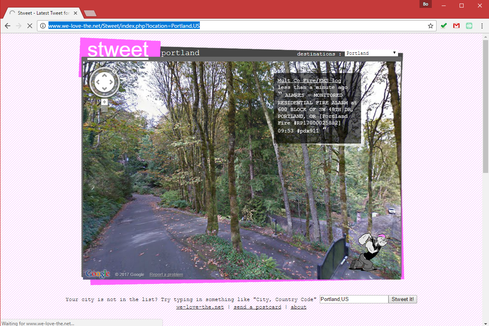
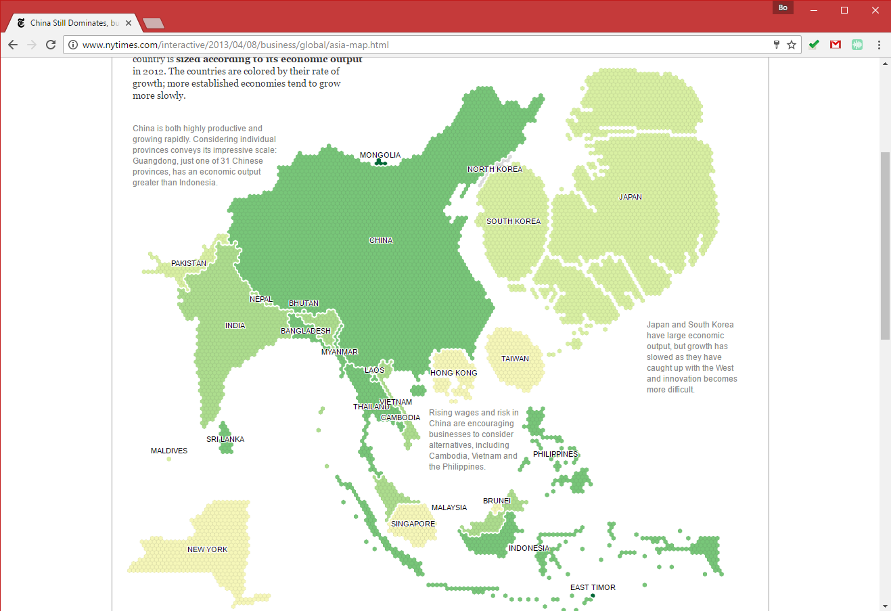
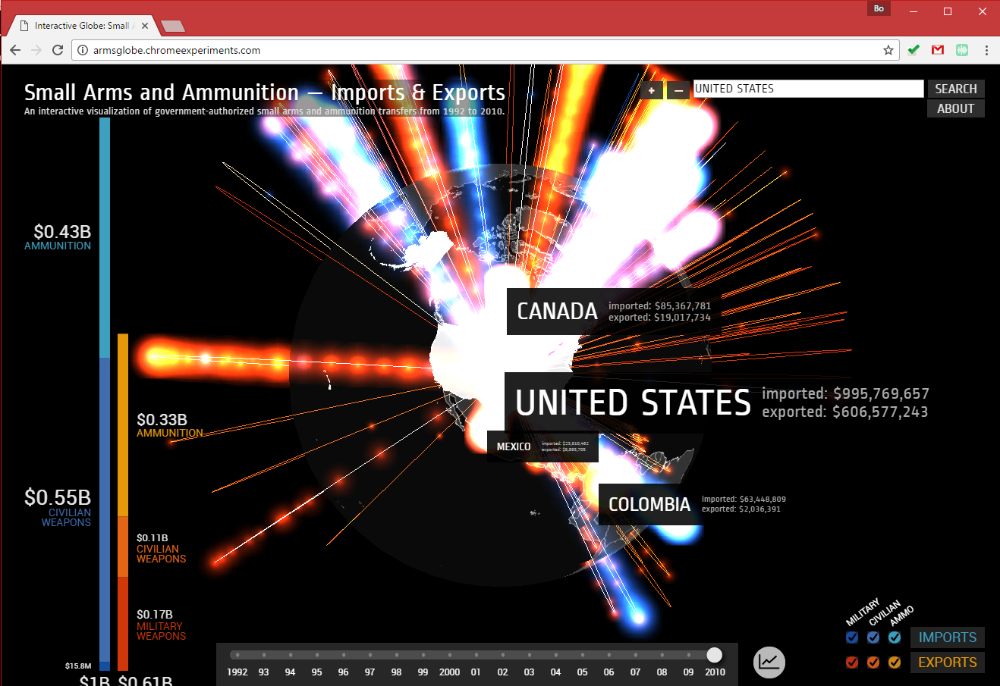

# Course Project: Brainstorm

> Spring 2017 | Geography 4/572 | Geovisualization: Geovisual Analytics
>
> Instructor: Bo Zhao, zhao2@oregonstate.edu | Office Hours: 3-4pm T or by appointment @347 Strand
>
> TA: Kyle R. Hogrefe, hogrefek@oregonstate.edu| Office Hours: TBD @257 Wilkinson
>
> Assigned: 04/04/2017 | Due: `04/05/2017by Noon ` | Points Available = 10

Welcome to Geog 4/572: Geovisual Analytics! In this course, you will learn the theories on geovisualization, some advanced geovisual analytical methodologies, and then work collaboratively on a real-world problem using geovisual analytical tools. This handout starts with an brief introduction to the lab (Digital lab @OSU) and the software setup. To find the geovisualization of your interests and the topic for the course project, this handout also lists some typical geovisualizations and some potential topics. Students are expected to submit their homework by the noon April 5th.

- Get to know the Digital Lab @ OSU.
- Get familiar with the major types of geovisualization via trendy examples.
- Reflect on which specific geovisual analytical method(s) are of your interests. 

## 1. Introduction

Let's first explore the Lab environment and the software setup for this course.

### 1.1 Digital Earth Lab @ Oregon State University

Digital Earth Lab is a teaching facility primarily for GIS, remote sensing, cartography, numerical analysis, and scientific visualization. The classroom is a facility of the OSU College of Earth, Ocean, and Atmospheric Science and is supported by the OSU Media Services. The lab was originally funded by a NASA infrastructure grant to Sherm Bloomer (professor & Dean, College of Science) and Nick Pisias (professor & former associate dean of COAS). Digital Earth is located in 210 Wilkinson Hall and is one of the most advanced teaching facilities on the Oregon State campus. We have been operational since the beginning of Spring term, 1999.

The lab generally opens 8am-5pm , a detailed schedule can be found at http://dusk.geo.orst.edu/de/de_teach.html. The manager of the facility is Cory Langhoff. If you need afterhours access, contact Cory Langhoff langhofc@oregonstate.edu, or dial 7-2532 to make arrangements. Please ahead of time.

### 1.2 Software Setup

This course relies on a series of professional software and web applications to make, debug, and browse web maps, including:

- **Webstorm:** A web mapping programming development environment;
- **MapBox:** An integrated platform for web mapping services;
- **QGIS:** An open source GIS desktop;
- **Chrome:** A Web browser;
- **Google Earth Pro:** A three-dimensional virtual globe with various geospatial data.

## 2\. Geovisualization Examples

This section introduces some major types of interactive geovisual applications. Regarding the course project, you are expected to work as a team to make a similar geovisual application. By viewing the following geovisual applications, you would get sense how geovisual skills can be applied for illustrating real-world problems.   

### 2.1 Storymap

Esri Story Maps let you combine authoritative maps with narrative text, images, and multimedia content. They make it easy to harness the power of maps and geography to tell your story. 

**[A River Reborn](http://storymaps.esri.com/stories/2015/river-reborn/)**

Please pay attention to how the author uses the 2D and 3D maps, and the multi-media.

**[California's Getting Fracked](http://www.facesoffracking.org/data-visualization/)**

Please pay attention to the use of map elements, and how the window scrolling behavior triggers the map events.

### 2.2 Virtual Globe

**[World Population](https://globe.chromeexperiments.com/)**

**[Noise Complaints in New York City](rawgit.com/jakobzhao/noise_complaints/master/index.html)**

How virtual globe is used to show thematic features.

**[Cesium-VR](https://github.com/NICTA/cesium-vr)**

The use of Virtual Reality in your geovisualization. In addition, please think about how can we use the map and 3d model collected by UAV to make geovisualizations.

### 2.3 Spatial data platform

**[National Map of Australia](http://nationalmap.gov.au/)**

please pay attention to the use of virtual globe, and how different types of geospatial data (especially **maps made by drone**) are overlain in the same visualization environment. 

### 2.4 Data-driven Geovisualization

**[Stweet](http://www.we-love-the.net/Stweet/index.php?location=Portland,US)**

Please pay attention to how different types of data are mashed up. 

**[Trendsmap](img/trendsmap.png)**

Geo-tagged tweets are real-timely collected and stored in a remote database, a `word cloud` of geo-tagged hashtag are visualized. Please reflect on the variety dimension of real-world issues. Can we clearly describe a phenomena merely based on one type of geovisualization?

**[Climate Proxies Finder](http://climateproxiesfinder.ipsl.fr/)**

> This application allows you to select different paleo-oceanographic proxies collected at LSCE according to various dimensions (spatial position, depth, age, archive, material type and chronological information).

Please pay attention to how different types of data are interacted.

**[Global temporal change](http://blogs.reading.ac.uk/climate-lab-book/files/2016/05/spiral_optimized.gif)**

**[Electric Generation in Spain](http://energia.ningunaparte.net/en/)**

Pay attention to the use of infographics.

### 2.5 Advanced Geovisual Analytics

**[Economic Output of Asian Countries - New York Times](http://www.nytimes.com/interactive/2013/04/08/business/global/asia-map.html)**

> In this map, geography is distorted so that each country is **sized according to its economic output** in 2012. The countries are colored by their rate of growth; more established economies tend to grow more slowly.

Pay attention to the use of cartogram.

**[TrumpLand vs. Clinton Archipelago](http://www.vividmaps.com/2016/12/trumpland-and-clinton-archipelago.html)**

The use of isoline maps

**[Migrations Map](http://migrationsmap.net/#/COD/arrivals)**

**[Small Arms and Ammunition - Import & exports]**

**[A Graph of the History of Philosophy](http://www.designandanalytics.com/philosophers-gephi/)**

Please pay attention to how social network is implemented to visualize connectivity.

## 3\. Project Topics (TBD...)

This section lists some general topics for the course project. 

### 3.1 Global Water

### 3.2 Narco-Trafficking

### 3.3 Sea Level Rise and Real Estate Market

### 3.4 MIT Disobedience

MIT Media Lab are now accepting nominations for the first-ever MIT Media Lab Disobedience Award, which carries a $250,000 cash prize, no strings attached.

**This award will go to a person or group engaged in what we believe is an extraordinary example of disobedience for the benefit of society.**

What does this mean? Societies and institutions lean toward order and away from chaos. While necessary for functioning, structure can also stifle creativity, flexibility, and productive change–and ultimately, society's health and sustainability. This is true from academia, to corporations, governments, the sciences, and our local communities. 
With this award, we honor work that impacts society in positive ways, and is consistent with a set of key principles. These principles include non-violence, creativity, courage, and taking responsibility for one’s actions. This disobedience is not limited to specific disciplines; examples include scientific research, civil rights, freedom of speech, human rights, and the freedom to innovate.

The MIT Media Lab Disobedience Award seeks to highlight effective, responsible, ethical disobedience across disciplines, and around the world. Disobedience Award objectives are to build awareness and support of disobedience-robust work being done, and to promote role models for younger people.

## 4\. Homework

The purpose of this handout is to help you brainstorm and identify the geovisualization you would like to work on in this term. Regarding the homework, please submit a word document, it should contain 

(1) **a url link of the geovisualization** to canvas;

(2) a short description of the specific geovisual analytical skills you are interested; and 

(3) you can also list the potential topics you would like to work on. **Think bold!** In the meantime, please keep in mind that this course is more about honing the geovisual analytical skills other than concentrating on a specific topic. 

**In the lecture this Thursday (4/6)**, you are required to present one geovisualization of your interest to the class.  You should submit the homework **by noon April 5th**.

