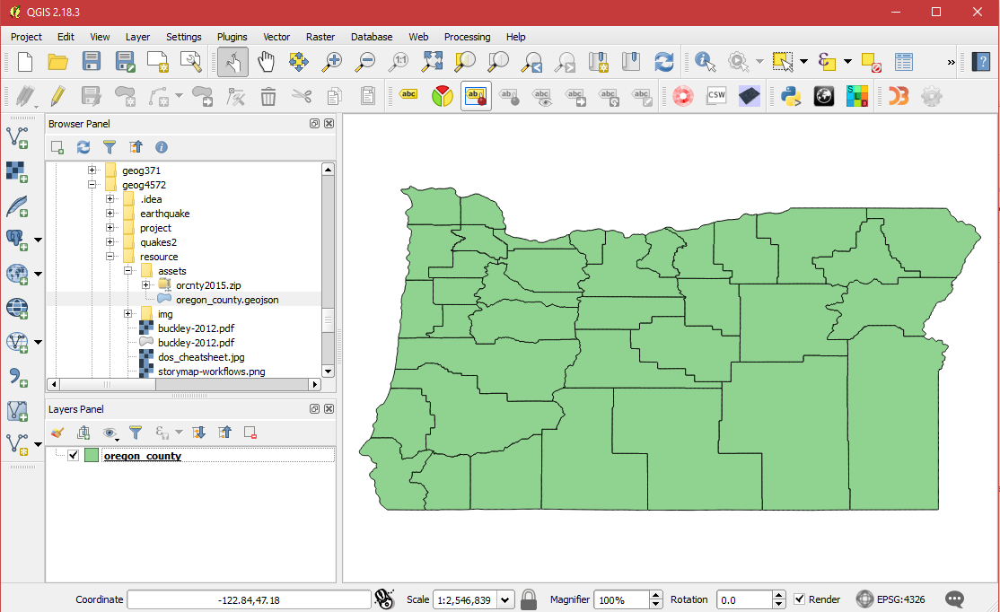
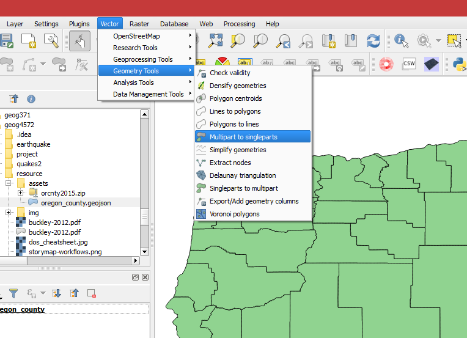
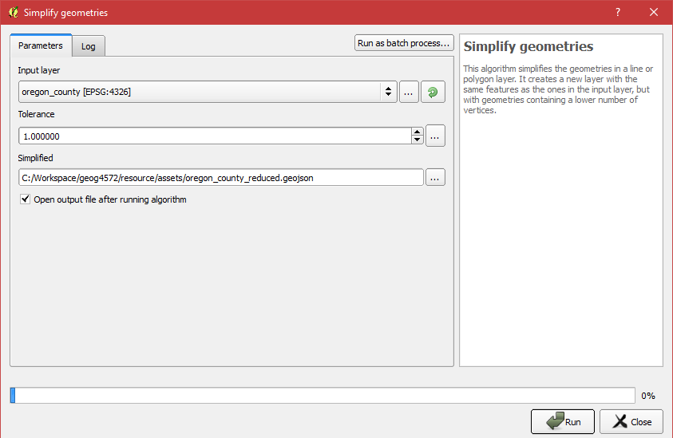
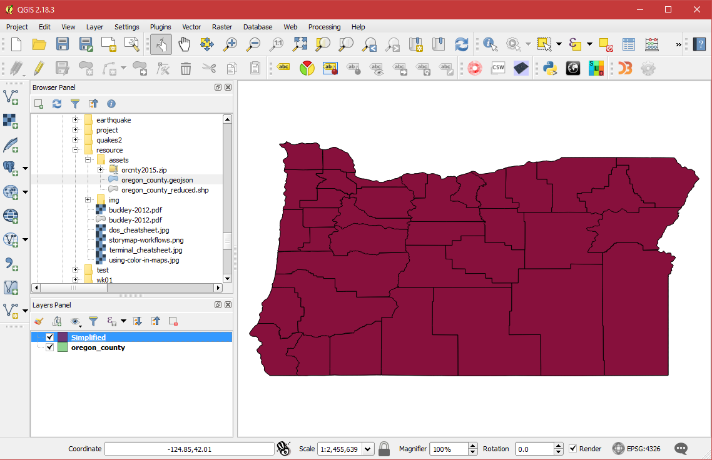

# Geometries Simplification

> Spring 2017 | Geography 472/572 | Geovisualization: Geovisual Analytics
>
> Instructor: Bo Zhao, zhao2@oregonstate.edu | Office Hours: 3-4pm T or by appointment @ strand 347
>
> TA: Kyle R. Hogrefe, hogrefek@oregonstate.edu| Office Hours: 1-2pm MF @ WLKN 257 and 2-4pm W @ WLKN 210

In the tutorial on [Convert Shapefile to Geojson](conversion_shp_geojson.md), I demonstrated how to convert a shapefile to a geojson file, However, if the generated file is still too larger, for example, the Oregon counties shapefile is around 10MB, you might still want to reduce the data size in order to make the geovisualization run smoothly. As you know, a line or polygon geometric feature are made by a set of points/nodes. We can further delete the unnecessary nodes but keep the shape of the original shape. To do that, we open [the geojson file of oregon county](oregon_county.geojson) which was generated according to the [shapefile conversion tutorial](conversion_shp_geojson.md).

The size of the original geojson data is 7,779 KB, this data can be easily visualized in a deskop program (e.g., QGIS), but it takes a longer peroid for a web browser to fully download and visualize it. Under some circumstances, a larger geospatial files cannot be propoerly processed because the web browser thinks it cannot process such a large data set at the client side.

1\. To reduce the size, open this geojson file in QGIS.

2\. On the main toolbar, navigate to `Vector` --> `Geometry Tools` --> `Simplify Geometries`.

> Note: **Simplify geometries algorithm** simplifies the geometries in a line or polygon layer. It creates a new layer with the same features as the ones in the input layer, but with geometries containing a lower number of vertices.

3\. On the opened dialog, fill in the `Input Layer` and the `Simplified` Layer name. In addition, the `Tolerance level` should be determined. For a data set covering a region like Oregon, I put the tolerance value as 0.001 degree.

4\. After you press the **run** button, the size of the polygon data will be reduced and a new data set will be simplifed and then automatically added to the map view.

Compared with the file sizes, [the original data](assets/oregon_county.geojson) is 7779kb, and [the reduced one](assets/oregon_county_reduced.geojson) is only 248kb.

5\. To validate the geojson data with a smaller size, we open the file in geojson.io. It works smoothly and efficiently.

To sum up, the efficiency of geospatial data transmission highly influences the effects of a web based interative geovisualization. If the geospatial data is too large, it may take a longer time period to load the data, or sometimes, the data can not be loaded. So, I would recommend to simplify the size of the geospatial data as much as possible.

