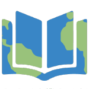
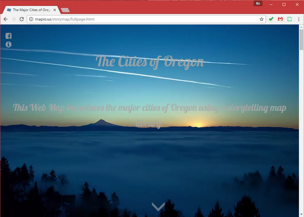

# Practical Exercise One: Interactive Geovisualization

> Spring 2017 | Geography 472/572 | Geovisualization: Geovisual Analytics
>
> Instructor: Bo Zhao | TA: Kyle R. Hogrefe | Location: Wilkinson 235 | Time: Tuesday 18-19:50pm
>
> Assigned: 04/18/2017 | Due: 05/02/2017 @11:59pm | Points Available = 50

## 1. Library Introduction

A story map is a strategy that uses a graphic organizer to learn the elements of a story. By identifying story characters, plot, setting, problem and solution, students read carefully to learn the details. There are many different types of story map graphic organizers. The most basic focus on the beginning, middle, and end of the story. More advanced organizers focus more on plot or character traits. Story maps is a framework for identifying the elements of a story and help you organize information and ideas efficiently.

Here are several free or proprietary map story tools we can use:

1. http://storymaps.arcgis.com/en/app-list/
2. http://storymap.knightlab.com/
3. http://cartodb.github.io/odyssey.js/
4. http://atlefren.github.io/storymap/
5. http://github.com/jakobzhao/storymap/

In this PE, we will use Storymap.js -- a story map telling library at [https://github.com/jakobzhao/storymap](https://github.com/jakobzhao/storymap). Using this library, you can create a map that follows a storyline. For each paragraph, you can place a map alongside it, and manipulate the map by zooming, panning, and even adding more thematic layers. This map library follows the concept **responsive design**, meaning the stories can be shown on any Desktop or mobile devices.



> **Note:** [the new version will support 3D thematic map](http://rawgit.com/jakobzhao/storymap/master/examples/3d/index.html).

### Demo

- [Cities of Oregon v.2.1.11](http://cdn.rawgit.com/jakobzhao/storymap/master/examples/video/index.html)




- [Oregon Drink Water](http://rawgit.com/cartobaldrica/water_atlas/master/drinking_index.html) -  made by [cartobaldrica](https://github.com/cartobaldrica)


- [Story Map Template](http://cdn.rawgit.com/jakobzhao/storymap/master/examples/helloWorld/index.html)


## 2. Deliverable

Please read through the front page of the [storymap.js](https://github.com/jakobzhao/storymap) on github. For this Practical Exercise, you are expected to build a story map based on this storymap.js library. To use this library, you will need to include the storymap.js and the storymap.css to your index html. If you are interested in building a 3D based storymap, you will need to include storymap3d.js. To download the library from github, you can simply use `git clone the_git_repository_url` in your terminal or the command prompt. The topic of the storymap could be diverse. It can be something related to your group project, or something of your interests. Regarding the organization of the storymap, you could use a clear storyline to present the topic, or you can use storymap.js to simply show a couple of interactive maps related to that topic.  But I would encourage you talk with your group project members before choosing a topic. *It could be an nice opportunity to generate some preliminary results for your group project.*

The file structure of your github repository should look like:

```Powershell
GEOG4572-PE1
│readme.md
│index.html
├─assets
│      XXX1.geojson
│      XXX2.geojson
├─css
│      style.css
├─img
│      XXX1.png
│      XXX2.png
│      XXX3.jpg
└─js
        main.js
```

Regarding the grading criteria, each storymap should have:

- At least three scenes which showing maps. **(POINT 8)**
- A full-size video or image based front page or end page; **(POINT 4)**
- Appropriate base map (e.g., Google map, Mapbox map, OpenStreetMaps, WMS, etc.) for each scene;  **(POINT 6)**
- Appropriate thematic map layers (e.g., geospatial data in geojson) for each scene;  **(POINT 6)**
- Add on some interactive features (e.g., clickable markers or polygons);  **(POINT 10)**
- Some necessary web map elements, such as title, legend, descriptions, navigation bar, scale bar, credit.  **(POINT 10)**
- A favicon; and  **(POINT 2)**
- Write at least a short introduction to your storymap on the readme.md (write documentation in markdown format).  **(POINT 4)**

 Do not worry if you come across some terms you are unfamiliar with, we will cover them in the lectures int the coming two weeks. Once you finish this PE, please make sure the program is executable in a web environment (testing it by python SimpleHTTPServer or Webstorm). If everything works fine, please upload the directory of the story map to github, and **only submit the url of the repository to canvas**. Please contact the instructor or TA if you have any difficulty in submitting the url.