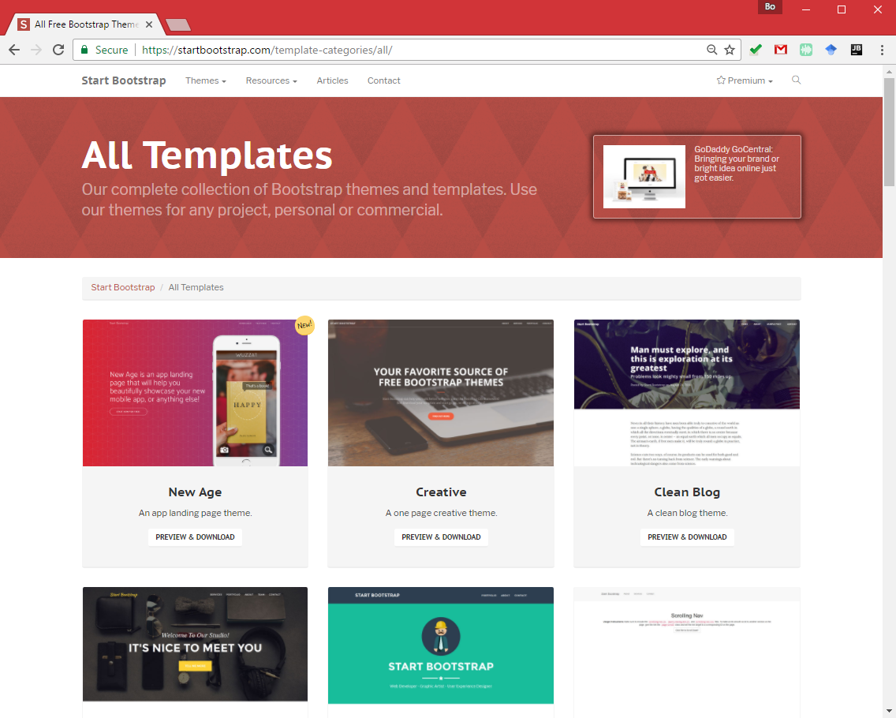
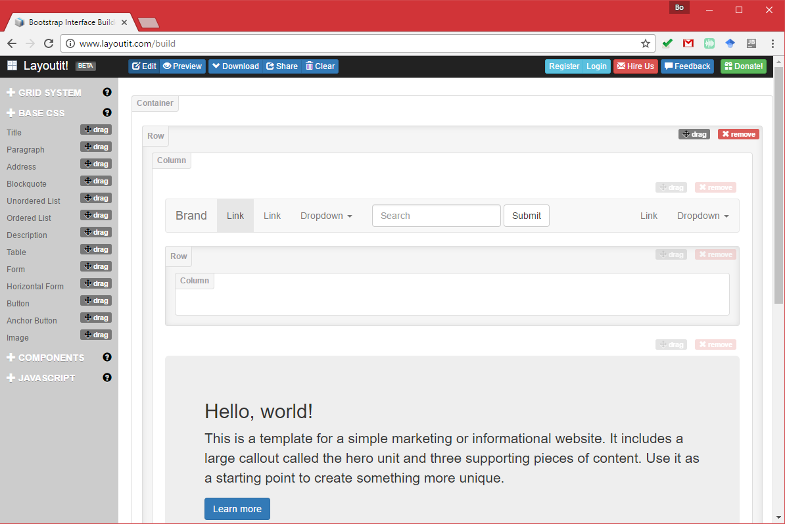

# Layout

> Spring 2017 | Geography 472/572 | Geovisualization: Geovisual Analytics
>
> Instructor: Bo Zhao | TA: Kyle R. Hogrefe | Location: LINC 368 | Time: Thursday 9-9:50am

**Learning Objectives**

- Understand the web design principles,
- Understand the map design principles;
- Learn the basic syntax of Bootstrap;
- Learn how to use Bootstrap to set up a web geovisualization; and 
- The layout of Storymap.js.

This lecture introduces the layout design of web based geovisualization. In this lecture, we start to list the two design principles - one for designing web site, and the other for designing map. In the second section of this lecture, we will use the library storymap.js to talk about how to design.

## 1. Web Based Geovisualization Design Principles

Designing an effective web based geovisualization requires more than just gathering relevant information and posting it on the web. Like a good paper or research presentation, a quality web project demands as much attention to the selection, organization, and presentation of material as to the underlying research itself. A web based geovisualization relates to both the web design and the map design. In this lecture, I lists two useful papers for your future references.

[1] David Porter (1999) **[Basic Map Design Principles](assets/porter-1999.pdf)**. retrieved April 20th, 2017 from [http://umich.edu/~ece/resources/design.html](http://umich.edu/~ece/resources/design.html)

[2] Buckley A (2012) **[Making Maps People Want to Look At](../resource/buckley-2012.pdf)**.  [http://www.esri.com/news/arcuser/0112/make-maps-people-want-to-look-at.html](http://www.esri.com/news/arcuser/0112/make-maps-people-want-to-look-at.html)

## 2. Bootstrap Framework

The framework we are going to focus on today is called Bootstrap. Bootstrap is a website framework built with HTML, CSS, and Javascript. A framework means that many page elements, common functions, and foundational components are already created for you to use and customize. You can use the pieces of the framework and customize the pieces and components for your own page, and even create your own. The components can be customized using HTML, CSS, and Javascript. Bootstrap was developed by Twitter, and is one of the most common frameworks for websites on the web today. More reading on Bootstrap, including lots of examples, can be found on the [Bootstrap homepage](http://getbootstrap.com/).

Here are some principal features of Bootstrap:

- Bootstrap is a free front-end framework for faster and easier web development
- Bootstrap includes HTML and CSS based design templates for typography, forms, buttons, tables, navigation, modals, image carousels and many other, as well as optional JavaScript plugins
- Bootstrap also gives you the ability to easily create __responsive (web) designs__.

>  **What is Responsive (Web) Design?** It is about creating web sites which automatically adjust themselves to look good on all devices, from small phones to large desktops.

One of the most important is that Bootstrap is designed to be friendly on mobile, meaning your site will resize to be viewable on mobile devices. Another is that Bootstrap has an excellent grid system that allows us a nice ability to layout our site into columns and divisions. **The grid system** uses the div element (remember, these are containers for the elements on our page), and arranges them into rows. More on the grid system: [http://getbootstrap.com/examples/grid/](http://getbootstrap.com/examples/grid/). The components provided by the Bootstrap framework and templates are on the [Bootstrap components site](http://getbootstrap.com/components), note that there are tables, dropdown menus, panels, dividers, and more. 

### 1.1 Bootstrap: Basics

**Download and include**

If you want to download and host Bootstrap yourself, go to [getbootstrap.com](http://getbootstrap.com/getting-started/), and follow the instructions there. If you don't want to download and host Bootstrap yourself, you can include it from a CDN (Content Delivery Network).

MaxCDN provides CDN support for Bootstrap's CSS and JavaScript. You must also include jQuery:

```js
<!-- Latest compiled and minified CSS -->
<link rel="stylesheet" href="https://maxcdn.bootstrapcdn.com/bootstrap/3.3.7/css/bootstrap.min.css">

<!-- jQuery library -->
<script src="https://ajax.googleapis.com/ajax/libs/jquery/3.1.1/jquery.min.js"></script>

<!-- Latest compiled JavaScript -->
<script src="https://maxcdn.bootstrapcdn.com/bootstrap/3.3.7/js/bootstrap.min.js"></script>
```

**Add the HTML doctype**

Bootstrap uses HTML elements and CSS properties that require the HTML5 doctype. Always include the HTML5 doctype at the beginning of the page, along with the `lang` attribute and the correct character set.

```html
<!DOCTYPE html>
<html lang="en">
  <head>
    <meta charset="utf-8"> 
  </head>
</html>	
```

**Bootstrap 3 is mobile-first**

Bootstrap 3 is designed to be responsive to mobile devices. Mobile-first styles are part of the core framework.

To ensure proper rendering and touch zooming, add the following tag inside the element:

```html
<meta name="viewport" content="width=device-width, initial-scale=1">	
```

The `width=device-width` part sets the width of the page to follow the screen-width of the device (which will vary depending on the device).

The `initial-scale=1` part sets the initial zoom level when the page is first loaded by the browser.

**Containers**

Bootstrap also requires a containing element to wrap site contents.

There are two container classes to choose from:

1. The `.container` class provides a responsive **fixed width container**
2. The `.container-fluid` class provides a **full width container**, spanning the entire width of the viewport

Please keep in mind that *Containers* are not nestable. Meaning you cannot put a container inside another container. Please execute the following two examples to see the differences.

```html
<!DOCTYPE html>
<html lang="en">
<head>
  <title>Bootstrap Example</title>
  <meta charset="utf-8">
  <meta name="viewport" content="width=device-width, initial-scale=1">
  <link rel="stylesheet" href="https://maxcdn.bootstrapcdn.com/bootstrap/3.3.7/css/bootstrap.min.css">
  <script src="https://ajax.googleapis.com/ajax/libs/jquery/3.1.1/jquery.min.js"></script>
  <script src="https://maxcdn.bootstrapcdn.com/bootstrap/3.3.7/js/bootstrap.min.js"></script>
</head>
<body>

<div class="container">
  <h1>My First Bootstrap Page</h1>
  <p>This is some text.</p> 
</div>

</body>
</html>
```

>  A basic Bootstrap page (with a responsive fixed width container)

```html
<!DOCTYPE html>
<html lang="en">
<head>
  <title>Bootstrap Example</title>
  <meta charset="utf-8">
  <meta name="viewport" content="width=device-width, initial-scale=1">
  <link rel="stylesheet" href="https://maxcdn.bootstrapcdn.com/bootstrap/3.3.7/css/bootstrap.min.css">
  <script src="https://ajax.googleapis.com/ajax/libs/jquery/3.1.1/jquery.min.js"></script>
  <script src="https://maxcdn.bootstrapcdn.com/bootstrap/3.3.7/js/bootstrap.min.js"></script>
</head>
<body>

<div class="container-fluid">
  <h1>My First Bootstrap Page</h1>
  <p>This is some text.</p> 
</div>

</body>
</html>
```

> A basic Bootstrap page (with a full width container)

**Bootstrap grids**

Bootstrap's grid system allows up to 12 columns across the page. If you do not want to use all 12 columns individually, you can group the columns together to create wider columns:


Bootstrap's grid system is responsive, and the columns will re-arrange automatically depending on the screen size.

**Grid Classes**

The Bootstrap grid system has four classes:

| Class Name  | Size           | Usage                        |
| ----------- | -------------- | ---------------------------- |
| `.col-xs-*` | Extra Small    | Phones Less than 768px       |
| `.col-sm-*` | Small Devices  | Tablets 768px and Up         |
| `.col-md-*` | Medium Devices | Desktops 992px and Up        |
| `.col-lg-*` | Large Devices  | Large Desktops 1200px and Up |

The classes above can be combined to create more dynamic and flexible layouts.

**Basic Structure of a Bootstrap Grid**

The following is a basic structure of a Bootstrap grid:

```js
<div class="row">
  <div class="col-*-*"></div>
</div>
<div class="row">
  <div class="col-*-*"></div>
  <div class="col-*-*"></div>
  <div class="col-*-*"></div>
</div>
<div class="row">
  ...
</div>
```

First; create a row (`<div class="row">`). Then, add the desired number of columns (tags with appropriate `.col-*-*` classes). Note that numbers in `.col-*-*` should always add up to 12 for each row.

Below we have collected some examples of basic Bootstrap grid layouts.

**Three Equal Columns**


The following example shows how to get a three equal-width columns starting at tablets and scaling to large desktops. On mobile phones, the columns will automatically stack:

```html
<div class="row">
  <div class="col-sm-4">.col-sm-4</div>
  <div class="col-sm-4">.col-sm-4</div>
  <div class="col-sm-4">.col-sm-4</div>
</div>
```

**Two Unequal Columns**


The following example shows how to get two various-width columns starting at tablets and scaling to large desktops:

```html
<div class="row">
  <div class="col-sm-4">.col-sm-4</div>
  <div class="col-sm-8">.col-sm-8</div>
</div>
```

### 2.2 Bootstrap Templates

To further enrich your web map templates, I encourage you browse some robust Boostrap templates. Two recommended sites for Bootstrap templates are:

- [StartBootstrap](http://startbootstrap.com/)
- [BootstrapZero](http://bootstrapzero.com/)



> Browse and download templates from **Start Bootstrap**

To facilitate the process of template design and customization, you can use the following tools to design interface or buttons.



> **Bootstrap Interface Builder** at [http://www.layoutit.com/build](http://www.layoutit.com/build)


### 2.3 The storymap.js Layout

 I relied on Bootstrap to make the template for web based geovisualization. As you might recall, there are two panel side by side, the right panel shows the map, the left shows the paragraphs. This layout actually uses the two unequal columns as below (the video example of `storymap.js`). The following html code is the skeleton of the index.html. 

```html
<!DOCTYPE html>
<html lang="en">
<head>
    <meta charset="utf-8">
    <meta name="viewport" content="width=device-width, initial-scale=1">

    <link rel="stylesheet" href="https://maxcdn.bootstrapcdn.com/bootstrap/3.3.7/css/bootstrap.min.css">
    <link rel="stylesheet" href="https://unpkg.com/leaflet@1.0.2/dist/leaflet.css" />
    <link rel="stylesheet" type="text/css" href="../../dist/storymap.css">

    <!--add required libraries-->
    <script src="https://unpkg.com/leaflet@1.0.2/dist/leaflet.js"></script>
    <script src="https://ajax.googleapis.com/ajax/libs/jquery/3.1.1/jquery.min.js"></script>
    <script src="https://maxcdn.bootstrapcdn.com/bootstrap/3.3.7/js/bootstrap.min.js"></script>
  
    <!--story map plugin-->
    <script src="../../dist/storymap.js"></script>
</head>
<body>
<div class="container-fluid">
    <div class="row">
        <div class="col-sm-6 col-md-4 main">
            <section data-scene="overview"></section>
            <section data-scene="portland"></section>
          ... ...
            <section data-scene="end"></section>
        </div>
        <div id="map" class="col-sm-6 col-md-8 sidebar"></div>
    </div>
</div>
...
  </body></html>
```


Please pay attention to the image, A `img-responsive` class is applied to the `img` tag. Then the image can automatically adjust its size when resizing the windows or opening in a different platform.

```html

```

### 2.4 Add an About Page

Similar to the Facebook button, we create another another button can invoke the about page.  This button shows an info-circle icon and lies right under the Facebook button.

```html
<!--info icon-->
<i class="fa fa-info-circle social" style="top:8%" data-toggle="modal" data-target="#info-modal"></i>
```

And then, we add a dialog. If the button is clicked, this dialog will be popped up.

```html
<!--the info page-->
<div class="modal fade" id="info-modal" role="dialog">
    <div class="modal-dialog modal-lg">
        <div class="modal-content">
            <div class="modal-header">
                <button type="button" class="close" data-dismiss="modal">&times;</button>
                <h4 class="modal-title">About</h4>
            </div>
            <div class="modal-body">
                <p>...</p>
            </div>
            <div class="modal-footer"></div>
        </div>
    </div>
</div>
```

**The "Trigger" part:**

To trigger the modal window, you need to use a button or a link.

Then include the two data-* attributes:

- `data-toggle="modal"` opens the modal window
- `data-target="#info-modal"` points to the id of the modal

**The "Modal" part:**

The parent `<div>` of the modal must have an ID that is the same as the value of the data-target attribute used to trigger the modal ("myModal").

The `.modal` class identifies the content of `<div>` as a modal and brings focus to it.

The `.fade` class adds a transition effect which fades the modal in and out. Remove this class if you do not want this effect.

The attribute `role="dialog"` improves accessibility for people using screen readers.

The `.modal-dialog` class sets the proper width and margin of the modal.

**The "Modal content" part:**

The `<div>` with `class="modal-content`" styles the modal (border, background-color, etc.). Inside this `<div>`, add the modal's header, body, and footer.

The `.modal-header` class is used to define the style for the header of the modal. The `<button>` inside the header has a `data-dismiss="modal"` attribute which closes the modal if you click on it. The `.close` class styles the close button, and the `.modal-title`class styles the header with a proper line-height.

The `.modal-body` class is used to define the style for the body of the modal. Add any HTML markup here; paragraphs, images, videos, etc.

The `.modal-footer` class is used to define the style for the footer of the modal. Note that this area is right aligned by default.

## References:

[1] http://duspviz.mit.edu/web-map-workshop/bootstrap-templates/

[2] http://www.tutorialrepublic.com/twitter-bootstrap-tutorial/

[3] http://www.w3schools.com/bootstrap/

[4] https://www.toptal.com/front-end/what-is-bootstrap-a-short-tutorial-on-the-what-why-and-how

[5]  https://www.smashingmagazine.com/2008/01/10-principles-of-effective-web-design/

